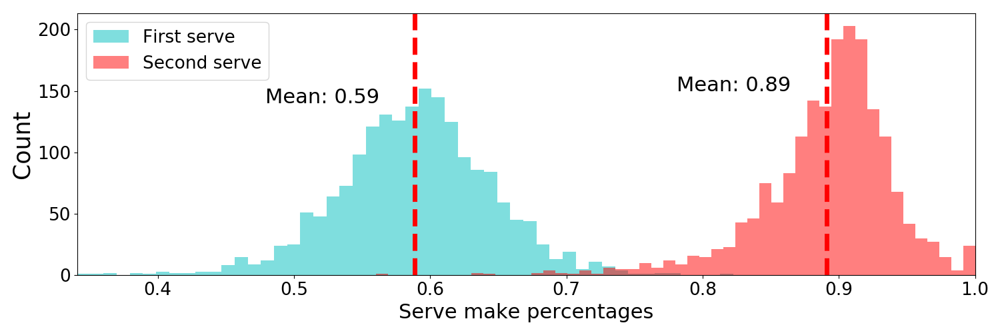

# ATP_serving_strategy
Analysis of ATP tennis serving strategies

Tennis is a sport in which players alternate serving. Each server is allowed two attempts to make a serve before being penalized a point for what is known as a 'double fault'. The conventional strategy is for a server to first hit a difficult, high-speed 'first serve' and then to hit a safer, lower-speed 'second serve' if his/her first serve did not go in. While this strategy is sound for many players, this project aims to identify matchups in which it may be beneficial for players to elect for a riskier strategy in which two first serves are attempted on all service points. The hope is the results of this study can be used to guide player strategies in hopes of optimizing match performance.

All data that this project was based on was retrieved from Jeff Sackmann's wonderful ATP data repository available at: https://github.com/JeffSackmann/tennis_atp
The data contained information on matches from 1991-2019, and thus my analysis is retricted to this subset. Further, matches with players with fewer that 50 career ATP matches were cut from the dataset in order to further restrict my analysis to players with significant ATP experience. 

This data exclusively contains information on ATP matches (not WTA matches), and thus any conclusions drawn will be most relevant to ATP players. 

# Framing the problem

To frame this problem, let us first define a few parameters for each player

First serve percentage (FSP): The percentage of times a server makes his/her first serve
First serve winning percentage (FSWP): The percentage of points that a server wins if his/her first serve lands in
First serve percentage (SSP): The percentage of times that a server makes his/her second serve
First serve winning percentage (SSWP): The percentage of points that a server wins if his/her second serve lands in

To get feel for how these parameters vary across the ATP, we can plot both serve winning percentage and serve make percentage for all ATP players in our dataset. 

